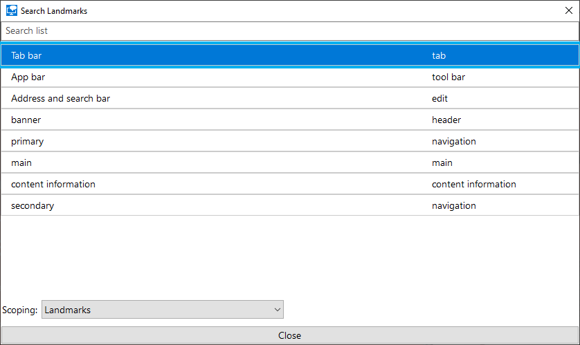
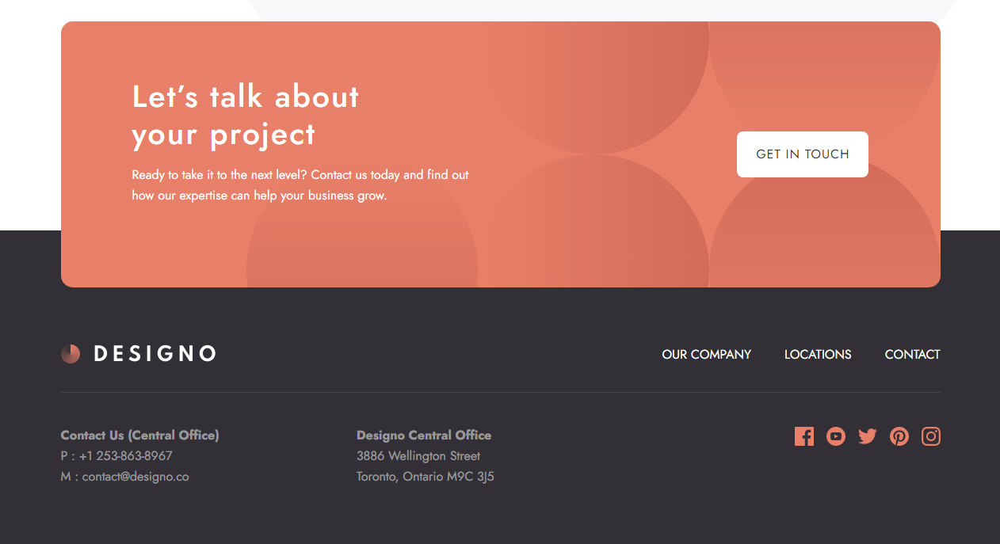
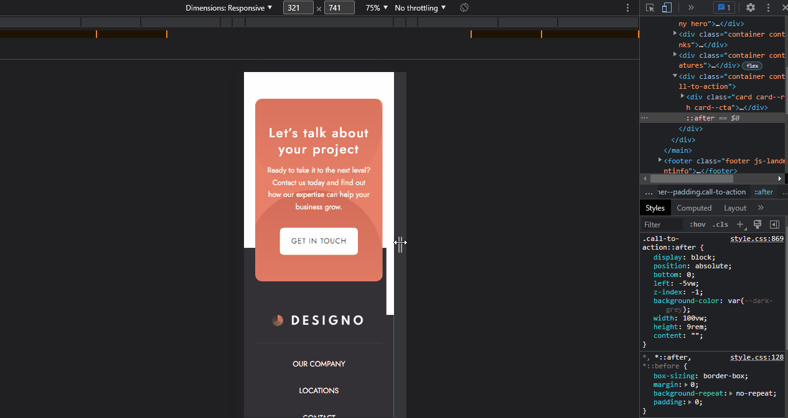

# Designo Multi-Page Website

I did this project to sharpen my HTML and CSS skills. It was the first time I created a 7-page website. I hoped this project proved that now I am ready to work in the professional world.

Now about this `README`, I wrote everything starting from tools that I used, useful articles, what I had learned, and much more.

## The challenge

My challenge is to build out this multi-page website and get it looking as close to the design as possible.

My users should be able to:

- View the optimal layout for each page depending on their device's screen size
- See hover states for all interactive elements throughout the site
- Receive an error message when the contact form is submitted if:
  - The Name, Email Address, or Your Message fields are empty should show "Can't be empty"
  - The Email Address is not formatted correctly should show "Please use a valid email address"
- View actual locations on the locations page maps
- See visible focus states for interactive elements when navigating by keyboard
- Understand and be able to navigate page content while using assistive technology
- Access the website without JavaScript

## Links

- [Live Review](https://officialdesigno.netlify.app/)
- [Frontend Mentor Solution Page](https://www.frontendmentor.io/solutions/designo-multipage-website-c6gfVhLZLm)
- [Documentation](./docs/README.md)

## Built with

- HTML Semantic Tags
- [BEM (Block, Element, Modifier)](https://sparkbox.com/foundry/bem_by_example)
- [Sass](https://sass-lang.com/)
- JavaScript
- CSS Flexbox
- CSS Grid
- Fluid Typography
- Fluid Space
- Mobile-first workflow
- No-motion-first approach to animations - Learn more — [prefers-reduced-motion: Taking a no-motion-first approach to animations](https://www.tatianamac.com/posts/prefers-reduced-motion)
- [Leaflet - a JavaScript library for interactive maps](https://leafletjs.com/)
- [instantpage/instant.page](https://github.com/instantpage/instant.page) - Preload pages only when the users interact with the link.
- [scriptex/hover-media-query](https://github.com/scriptex/hover-media-query) - A progressively enhanced "hover" media query.
- [GoogleChrome/inert-polyfill](https://github.com/GoogleChrome/inert-polyfill) - Polyfill for the HTML `inert` attribute. (modified)

## What I learned

I learned a lot of things when I was building this project. I hope this can be useful for you and my future self.

### Labeling navigation landmarks

It is important to know that there are two navigation landmarks. Narrator listed both navigation landmarks as "navigation". This can confuse screen reader users because they can think of it as duplicate content.


"If a specific landmark role is used more than once on a page, provide each instance of that landmark with a unique label." — [Landmark Regions | APG | WAI | W3C](https://www.w3.org/WAI/ARIA/apg/practices/landmark-regions/)

I needed to label each navigation landmark so that the screen reader users can differentiate them.

```html
<!-- header navigation -->
<nav aria-labelledby="primary-navigation">
  <p id="primary-navigation" hidden>primary</p>
</nav>

<!-- footer navigation -->
<nav aria-labelledby="secondary-navigation">
  <p id="secondary-navigation" hidden>secondary</p>
</nav>
```

As a result, Narrator will read the first navigation as "primary navigation" and the second one as "secondary navigation".



For your information, I used Narrator on Edge browser.

"Narrator works best with Microsoft Edge." — [Narrator Keyboard Shortcuts | Screen Reader Keyboard Shortcuts and Gestures](https://dequeuniversity.com/screenreaders/narrator-keyboard-shortcuts)

By the way, I could use `aria-label` to do that. But, the value of it does not always get translated. So, I decided to use that approach instead.

Read more — [aria-label Does Not Translate](https://adrianroselli.com/2019/11/aria-label-does-not-translate.html)

### Hamburger menu is not the ultimate solution

Hamburger menu is a button with three horizontal lines. It is used to hide navigation options (usually for mobile users). When it is clicked it opens navigation links.

There are pros and cons to the hamburger menu. But, one thing that is sure is that it takes at least two clicks for the users to navigate to another page.

Research shows that users prefer visible navigation than hidden navigation (like those behind a hamburger menu).

Read more — [Hamburger Menus and Hidden Navigation Hurt UX Metrics](https://www.nngroup.com/articles/hamburger-menus/)

As a developer, I prefer visible navigation. It does not need a lot of styling. It does not need JavaScript. It is less code to write.

"Less is more." — Ludwig Mies van der Rohe

### How to create a hamburger menu?

I had seen that people have two HTML markups for the navigation links. One markup for the hamburger menu and one markup for visible navigation. Usually, they have a `hide-on-desktop` and `hide-on-mobile` classes. 

The `hide-on-desktop` class has `display: none` and wraps inside a media query (assuming that they write the CSS with the mobile-first approach). Then, the `hide-on-mobile` class has `display: none` as the default styling, then switch to `display: block` to make the menu visible (it doesn't have to be `display: block`).

That was the first idea that I had when I was thinking to create the hamburger menu. But, duplicate HTML markup is not good. More code to write, more things to maintain.

So, I challenged myself to only have one HTML markup for the hamburger menu. But, how? I found the answer by trying it myself. The first thing that I did was to code the HTML without thinking about the hamburger menu. Then, I added a `<button>` above the list for the menu button.

```html
<!-- Inside the <nav> -->
<button type="button">
  <span>Menu</span>
  
</button>
<ul>
  <li>
    <a href="/about.html">
      Our Company
    </a>
  </li>
  <li>
    <a href="/locations.html">
      Locations
    </a>
  </li>
  <li>
    <a href="/contact.html">
      Contact
    </a>
  </li>
</ul>
```

With the following HTML markup, it was not a hamburger menu, it was a list of links. After thinking more about it, I realized that it was not about HTML. It was about the styling.

Hamburger menu was made possible by CSS. I should manipulate the look of the menu. Not the HTML. Then, I used JavaScript to toggle the visibility of the menu. So, there is no need for two HTML markups to create it.

Now, the HTML markup that I had lacked things. There was no way for screen readers to know whether the menu button was expanded or collapsed. I could improve the experience for the screen reader users by providing ARIA (Accessible Rich Internet Applications) attributes. 

I added `aria-expanded` attribute to the `<button>` to tell screen readers its state of it. By default, I set it to `false` which will tell screen readers that the menu button is collapsed.

Learn more — [`aria-expanded` - Accessibility | MDN](https://developer.mozilla.org/en-US/docs/Web/Accessibility/ARIA/Attributes/aria-expanded)

```html
<button type="button" aria-expanded="false">
  <span>Menu</span>
  
</button>
```

Then, I added `aria-controls` to the `<button>` to tell screen readers that this button is controlling the `<ul>`.

```html
<button
  type="button"
  aria-expanded="false"
  aria-controls="menu-list"
>
  <span class="sr-only">Menu</span>
  
</button>
<ul id="menu-list">
```

HTML was done. Now, I needed to take care of the styling.

I needed to use fixed positioning and then style the links. Then, set the background color of the menu which was black. After that, I added some `padding` to prevent the links from touching the edges of the browser. After I had done styling the menu, I needed to hide the menu.

I noticed some people only hide the menu visually. Sometimes they set the menu to `opacity: 0` or use `transform` with `translate()` function to place it outside the browser's window. It was only visually hidden. It created issues. The menu items were still accessible with the keyboard by tabbing and screen readers.

So, I thought of two ways to make sure the menu was truly hidden. It was either to set `display: none` or `visibility: hidden`. Both will make the menu inaccessible or disappear from the accessibility tree.

Learn more about accessibility tree — [The Accessibility Tree](https://web.dev/the-accessibility-tree/)

I used `visibility` property to hide the menu. This way, I could use `transition`. Then, I set `transform: translateY(-100%)` to make it move outside of the browser's window.

```css
/* <ul id="menu-list" class="header__list"> */
.header__list {
  transform: translateY(-100%);
  visibility: hidden;
}
```

Next, to make the menu visible, I could think of two ways. The first way, I could use JavaScript by adding a class like `is-open` to the `<ul>`. The second way, I could use the `aria-expanded` as the state and for the styling hook at the same time.

The first approach required more JavaScript. I had to use `classList` to toggle the class. While, with the second approach, I did not need to do that. I only needed to change the value of the `aria-expanded` with JavaScript and the styling would get applied.

I used the attribute selector (`[aria-expanded="true"]`) and general sibling combinator (`~`) to make the menu visible.

Learn more — [Attribute selectors - CSS: Cascading Style Sheets | MDN](https://developer.mozilla.org/en-US/docs/Web/CSS/Attribute_selectors)

Learn more — [General sibling combinator - CSS: Cascading Style Sheets | MDN](https://developer.mozilla.org/en-US/docs/Web/CSS/General_sibling_combinator)

```css
/**
 * <button type="button" class="header__menu-button" aria-expanded="true">
 * <ul id="menu-list" class="header__list">
 */
.header__menu-button[aria-expanded="true"] ~ .header__list {
  transform: translate(0);
  visibility: visible;
}
```

Once the styling was done, I wrote some JavaScript to make it work.

I grabbed the menu button, `<body>`, and `` inside the menu button. The menu button was needed to toggle the `aria-expanded` value (`true` or `false`). The `<body>` was needed to prevent the page from scrolling while the menu was opened. The `` inside the menu button was needed to switch the hamburger menu icon to a close icon.

Then, I also grabbed `<main>` and `<footer>` to add `inert` attribute. The purpose is to trap focus on the `<header>`. It means the users can not focus on the interactive elements outside the `<header>`.

With all those things, I managed to create the hamburger menu.

But, there is one more thing. The users can resize the browser's window. Desktop users can resize the browser's window using the cursor. Mobile users can rotate their phones to landscape mode or to portrait mode. There is a situation when the menu is opened and then the users make their screen larger than `650px`, the hamburger menu will turn into visible navigation or horizontal menu. But, the page will not be scrollable. 

Remember, I grabbed the `<body>` to prevent the page from scrolling while the menu was opened. This made the page would not be scrollable in other words, there will be no vertical scrollbar. This is a bad user experience.

The solution to that was to use a media query inside JavaScript. I used the `matchMedia()` method and then gave `(min-width: 40.625em)` as the parameter. Here is the code snippet.

```javascript
const onLargeScreen = window.matchMedia("(min-width: 40.625em)");

// Note: This is not the full code for the function
const closeMenu = () => {
  body.classList.remove("is-menu-open");
};

onLargeScreen.addEventListener("change", closeMenu);
```

So, when the users' screen size is changed, it will run the `closeMenu()` function. Then, it will remove the `is-menu-open` styling — `body.is-menu-open { overflow: hidden }`. Now, the page is scrollable when the opened hamburger menu turns into visible navigation.

### Hamburger menu has a problem

If you increase the zoom level to 250%, the "CONTACT" link is not visible. You can not scroll to see the link.

When I tried to solve this, I set an `overflow-y: auto`. The result was nothing. It did not give me a vertical scrollbar. It was because the list was not having an overflowing element. It was the `<body>` that had overflowing content.

Also, because of the way the menu is treated where the users should not be able to scroll the page while the menu is opened, I can not set `overflow-y: auto` to the `<body>` either.

So, I could not solve the issue. If anyone knows how to solve the problem or wants to discuss this with me, please do let me know. We can have a discussion on the solution page.

Discuss the issue with me — [Frontend Mentor | Responsive Designo Multi-Page Website with Grid and Flexbox coding challenge solution](https://www.frontendmentor.io/solutions/designo-multipage-website-c6gfVhLZLm)

### Responsive grid on design pages with no media queries

At first, I was building the section with CSS Grid, Flexbox, and media queries. Later, I managed to create a responsive grid layout with no media queries.

Before I continue, I want to let you know that as I am telling you my process, I will only show you the necessary code. Also, take a look at the site and resize your browser's window. This way, you can better understand the responsiveness of the site.

See the live site — [Web Design - Designo](https://officialdesigno.netlify.app/web-design.html)

Going back to my process, I wrote this HTML markup for the cards' container and the card.

```html
<div class="projects">
  <a href="/" class="projects__card">
    
    <span class="projects__container">
      <span class="projects__title">Express</span>
      <span class="projects__description">
        A multi-carrier shipping website for ecommerce businesses
      </span>
    </span>
  </a>
  <!-- The other card elements go here -->
</div>
```

Note: I made each card with an anchor tag because it had a hover effect. So, all of them should be interactive elements. I assumed that if this was a real website, then each link would navigate the users to the project (e.g. Express project, etc).

After the HTML was done, it was time to create the layout.

I set the spacing for the card using `gap` property. So, I made the cards' container a flex container.

```css
.projects {
  display: flex;
  flex-direction: column;
  gap: 1.875rem;
}
```

Then on the desktop layout, I made it a grid container to create a three-column layout.

```css
@media screen and (min-width: 59.375em) {
  .projects {
    display: grid;
    grid-template-columns: repeat(3, 1fr);
  }
}
```

Now for the card, I used flexbox to make it a two-column layout for the tablet layout.

```css
@media screen and (min-width: 42.1875em) {
  .projects__card {
    display: flex;
  }
}
```

After that, I made it into a one-column layout for the desktop layout.

```css
@media screen and (min-width: 59.375em) {
  .projects__card {
    flex-direction: column;
  }
}
```

The image of the card needed to adapt based on the card layout. When the card was in a one-column layout the image should take up the full width of the card. Then, when the card was on the two-column layout, the image should have half of the card's width.

```css
.projects__image {
  width: 100%;
}

@media screen and (min-width: 42.1875em) {
  .projects__image {
    width: 50%;
  }
}

@media screen and (min-width: 59.375em) {
  .projects__image {
    width: 100%;
  }
}
```

Note: I did not use `flex-basis` even though the card was a flex container. That is because when I set `flex-basis: 100%` the image did not fill the entire width of the card. I assumed that it followed the size of the `width` and `height` attributes. Also, if I used `flex-basis` when the `flex-direction` was set to `column`, the `flex-basis` would control the height of the image. So, that was why I used `width` instead of `flex-basis`.

The result was a responsive layout with CSS Grid, Flexbox, and media queries.

<details>

<summary>Preview the result of the approach</summary>


</details>

But, I used media queries. It means that I can not use the `projects` component if its width of it depends on the viewport's width instead of the container's width.

Note: Component is a set of code that can be reused many times throughout the project.

It turned out that it is possible to create that layout responsively with no media queries. There is a technique called "Repeat, Auto, Minmax" (RAM). I knew it from [1-Line Layouts](https://1linelayouts.glitch.me/).

The idea of RAM is to have a grid container that controls the layout. Here is an example.

```css
.parent {
  display: grid;
  gap: 1rem;
  grid-template-columns: repeat(auto-fit, minmax(12rem, 1fr));
}
```

Now, how did I implement this technique into my layout?

On the container of the cards, I did the following.

```css
.projects {
  display: grid;
  grid-template-columns: repeat(auto-fit, minmax(min(21.875rem, 100%), 1fr));
  gap: 1.875rem;
}
```

I used `auto-fit` as the first value of the `repeat()` function so that it allows the browser to create more columns when there is enough space. It also will make sure that the grid items are filling the available space.

Note: In this case, there is no difference when I used `auto-fill` instead of `auto-fit`. But, after learning the difference between the two, I decided to use `auto-fit`.

Learn the difference between `auto-fit` and `auto-fill` — [Auto-Sizing Columns in CSS Grid: `auto-fill` vs `auto-fit` | CSS-Tricks](https://css-tricks.com/auto-sizing-columns-css-grid-auto-fill-vs-auto-fit/)

Then, I used `minmax()` as the second value to guide the browser about the size of each column. I wrapped the first value of `minmax()` with `min()`. By setting `min(21.875rem, 100%)`, I am saying that, "If there is not enough space for the element to be `21.875rem`, then you can have `100%` width of the parent element". The purpose is to make the grid items allowed to shrink if ever needed. I set `1fr` for the maximum value of the width. This way, each column would take the available space and make sure all the columns have the same width.

For the card layout, I did this.

```css
.projects__card {
  display: grid;
  grid-template-columns: repeat(auto-fit, minmax(min(18.75rem, 100%), 1fr));
}
```

I used `repeat()` to allow browsers to create more columns based on the guide that I gave. Then, for the first value, I wrote `auto-fit` so the browser can automatically create more columns when there is enough space.

After that, I used `minmax()` function. For the first value that is the minimum width of each grid item should be `18.75rem` (`300px`). It is wrapped by `min()` function and the second value is `100%` to allow it to shrink if needed. For the maximum width, I gave it `1fr` to allow it to grow while still making sure each grid item has the same width.

As for the image, there was nothing to worry about it since CSS Grid would take care of it. Unlike CSS Flexbox which is flexible, CSS Grid forced the image as a grid item to obey the rules.

This result is a responsive layout for both the container of the cards and the card with no media queries.

### Card above footer



I could think of three ways to position the card above the `<footer>`.

First, I could use relative positioning on the card to position it about the `<footer>`. But, there was one problem with this approach. I had to set a lot of `padding` on the `<footer>` to give some space for the card. This would make the spacing not consistent. I also had to calculate how much extra spacing was needed for the card.

For your information, a year ago, I was using this approach when I built "Fylo dark theme landing page".

See the solution for the challenge — [Frontend Mentor | Fylo Dark Theme Landing Page HTML5 CSS3 Sass coding challenge solution](https://www.frontendmentor.io/solutions/fylo-dark-theme-landing-page-html5-css3-sass-71fZb3LhF)

Second, I could create a pseudo-element on the card to create a black background. So, it makes the card visually above the `<footer>`. This was the worst way. Here are the proofs:

- The card was not filling the entire page on large screen sizes. The same behavior applied to its pseudo-element.
- I set `width: 100vw` and it made a horizontal scrollbar showing up.
- I set `left: -5vw` and it only looked good on my screen. Once I resized, the screen the pseudo-element became misaligned.
- I gave up.

<details>

<summary>Preview the result of the approach</summary>



</details>

Third, I used a pseudo-element from the `<footer>` to make black background below the card. This made the card visually above the `<footer>` when it was actually above the pseudo-element of the `<footer>`. Here is the CSS to create the pseudo-element:

```css
/* <footer class="footer js-landmark" role="contentinfo"> */
.footer::after {
  display: block;
  position: absolute;
  top: -9rem;
  left: 0;
  z-index: -1;
  background-color: var(--dark-grey);
  width: 100%;
  height: 100%;
  content: "";
}
```

Now, you can see the result by visiting the site. It is responsive with no media query and works on all screen sizes.

### Fake horizontal rule

There is a horizontal line in the `<footer>`. It is one pixel height (`0.0625rem`) and has 10% opacity. I was hard to notice. But, it was easy to create.

I managed to create it with pseudo-element and it was responsive with no media query. Here is the code snippet:

```css
/* <div class="footer__line footer__container"> */
.footer__line::before {
  display: block;
  position: absolute;
  top: 3.75rem;
  left: 0;
  opacity: 0.1;
  background-color: var(--white);
  width: 100%;
  height: 0.0625rem;
  content: "";
}
```

### No JavaScript, no problem

The site can work even when the users disable JavaScript. You can try it yourself.

If mobile users enable JavaScript, they get a hamburger menu. If they disable JavaScript, they get visible navigation or a horizontal menu.

Next, if the users enable JavaScript, they get custom form validation. If they disable JavaScript, they get native HTML form validation.

After that, if the users on the location page with JavaScript enabled, they get decorative leaflet maps. If they disable JavaScript, they get static images for the maps.

## Useful resources

- [Ten modern layouts in one line of CSS | web.dev](https://web.dev/one-line-layouts/) - There ten modern CSS code snippets. I used the "Sidebar Says" code snippet to create the layout for the `feature__item` on the tablet design.
- [Frontend Mentor | Responsive Multi-Page Website with Grid and Flexbox coding challenge solution](https://www.frontendmentor.io/solutions/responsive-multipage-website-with-grid-and-flexbox-MgG8IlyIbc) - This is my previous solution before this one. It helped me to create the hamburger menu. I would say that my past self help me create it. So, by the time I was building it for this challenge, most of it I did copy-paste from the previous solution.
- [How To Create Accessible Form with Boring Design? - CodeNewbie Community 🌱](https://community.codenewbie.org/vanzasetia/how-to-create-accessible-form-with-boring-design-4ab0) - This is my article about creating accessible form by using some ARIA attributes to enhance the experience of the users of assistive technology. It helped me to implement the form validation for this website.

## Author

Frontend Mentor - [@vanzasetia](https://frontendmentor.io/profile/vanzasetia)

## Acknowledgements

Grace Snow answered all my questions in the Frontend Mentor's Slack community. Thank you very much, Grace!

See her profile — [Frontend Mentor | Grace's profile](https://www.frontendmentor.io/profile/grace-snow)

## License

[MIT](./LICENSE)
